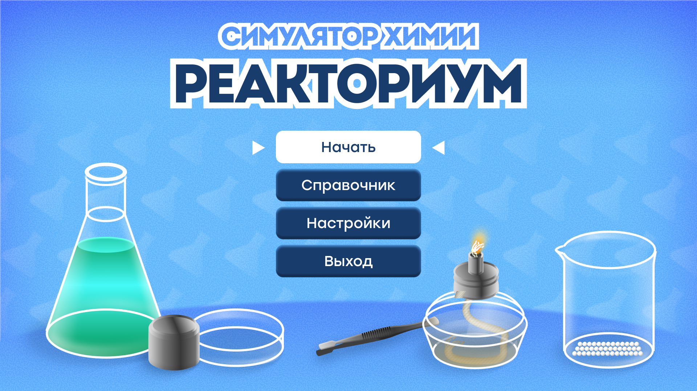
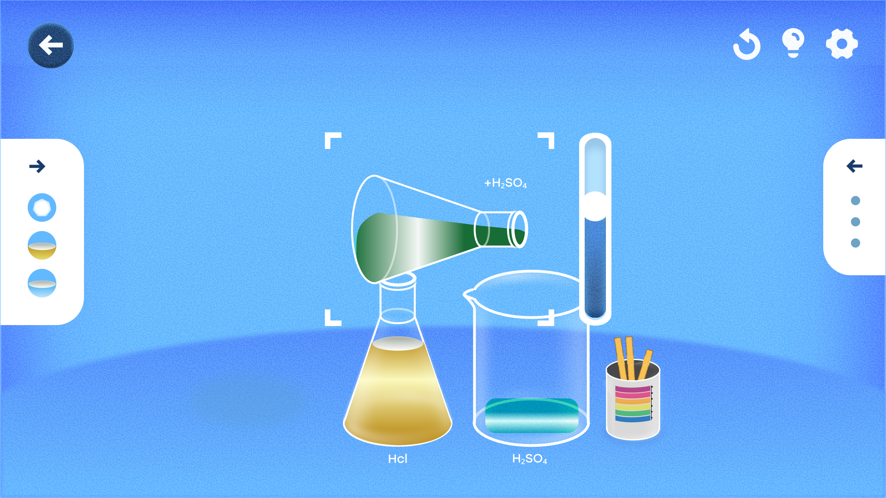
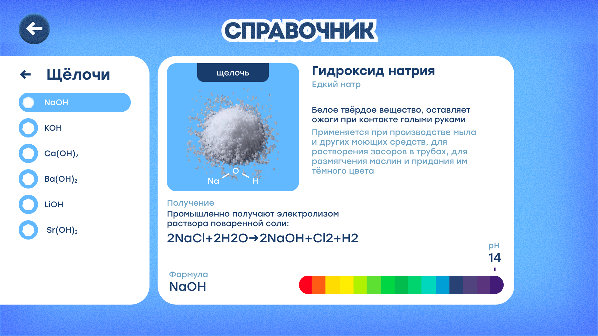
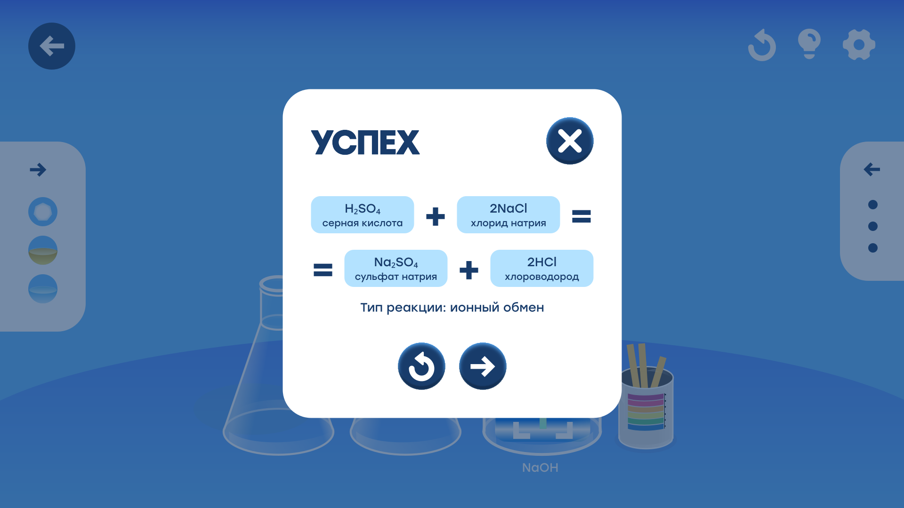
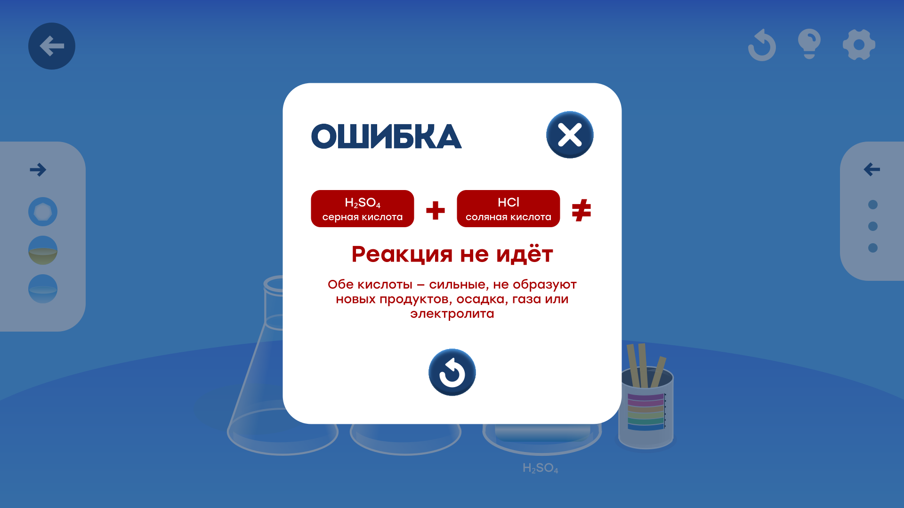
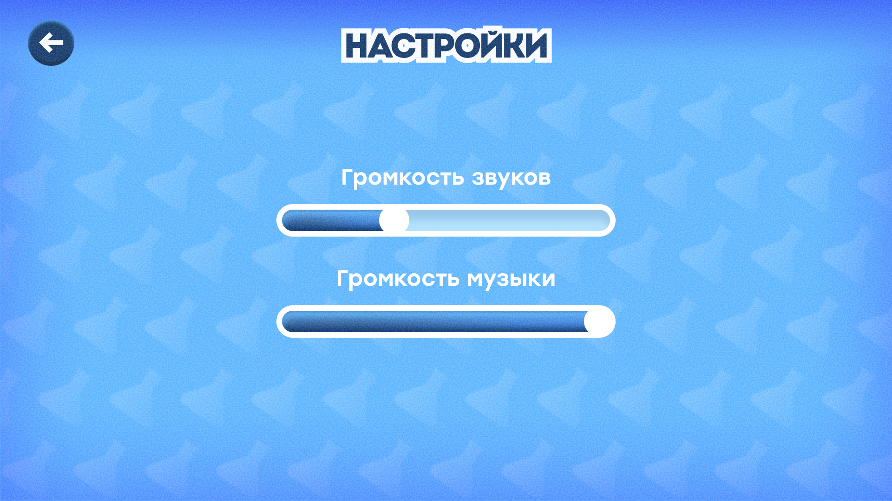

# Реакториум

  

**Реакториум** — образовательная игра-симулятор химии для школьников 7–8 классов.  
Проект выполнен как выпускная квалификационная работа и знакомит с базовыми химическими процессами через интерактивную виртуальную лабораторию.

В игровой форме игрок смешивает реактивы, проводит реакции, проверяет кислотность индикатором и получает понятную обратную связь — от уравнения реакции до объяснения, почему опыт не удался.

---

## Ссылки

- Веб-билд (Unity WebGL):  
  https://tainiikrab.github.io/reactorium-game/

- Репозиторий:  
  https://github.com/tainiikrab/reactorium-game

---

## О проекте

- Жанр: образовательная игра, симулятор  
- Аудитория: учащиеся 7–8 классов  
- Платформа: Web (Unity WebGL), Windows  
- Движок: Unity  
- Язык программирования: C#

---

## Что реализовано

Проект объединяет учебное содержание школьной химии с игровыми механиками и визуальной обратной связью.

В рамках разработки реализованы:

- виртуальная лаборатория с переливанием реактивов, нагревом и проверкой pH  
- система химических реакций с уравнениями, типом реакции и объяснением ошибок  
- пошаговые задания уровней и прогрессия по маршруту  
- справочник веществ с свойствами, применением и шкалой pH  
- пользовательский интерфейс и визуальный стиль (Figma → Unity)  
- модульная архитектура на C# (Zenject, ScriptableObjects)  
- сборка и публикация WebGL-билда на GitHub Pages

---

## Скриншоты

  
   <em>Выбор уровня</em>

 

  
   <em>Рабочее пространство лаборатории</em>

 

  
   <em>Переливание веществ и визуализация опыта</em>

 

  
   <em>Карточка реактива с дополнительной информацией</em>

 

  
   <em>Справочник веществ</em>

 

  
   <em>Успех: уравнение реакции и её тип</em>

 

  
   <em>Ошибка: почему реакция не идёт</em>

 

  
   <em>Настройки звука и музыки</em>

